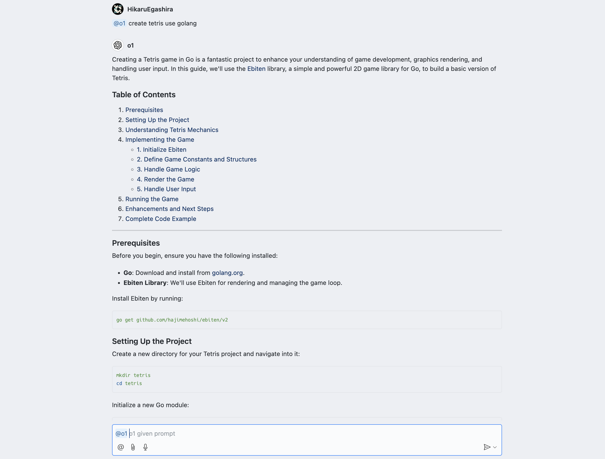

# o1 in VSCode

- @o1 を使うことでOpenAIのo1-miniモデルを用いて応答することができるようになります。

## Development

- Run `npm install` in terminal to install dependencies
- Run the `Run Extension` target in the Debug View. This will:
	- Start a task `npm: watch` to compile the code
	- Run the extension in a new VS Code window

> - ターミナルで `npm install` を実行して依存関係をインストールします
> - デバッグビューで `Run Extension` ターゲットを実行します。これにより:
> 	- コードをコンパイルするためのタスク `npm: watch` が開始されます
> 	- 新しい VS Code ウィンドウで拡張機能が実行されます
